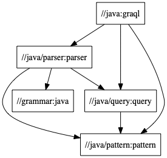

# Graql Java API

## Package Structure

> To update the diagram above, run `docs/deps.sh //java/... java-package-structure` and it will regenerate the image using Graphviz (to install: `brew install graphviz`). Note that we ignore external dependencies (3rd party and `@graknlabs_*`), as well as the `//java/common` package in which every package depends on.
